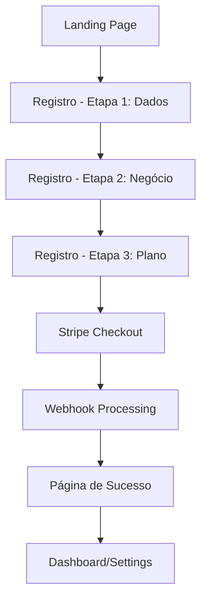
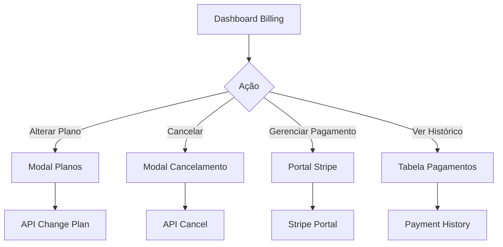
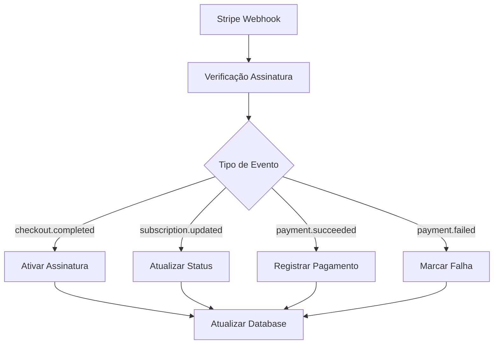

# 💳 Implementação de Billing e Stripe - UBS

## ✅ Status da Implementação

**Todas as funcionalidades de billing foram implementadas com sucesso!**

### 🎯 Funcionalidades Completadas

| Funcionalidade | Status | Arquivos |
|---|---|---|
| 🟢 **Landing Page** | ✅ Completa | `src/frontend/landing.html` |
| 🟢 **Sistema de Login** | ✅ Completo | `src/frontend/login.html` |
| 🟢 **Página de Registro** | ✅ Completa | `src/frontend/register.html` |
| 🟢 **Configuração do Cliente** | ✅ Completa | `src/frontend/settings.html` |
| 🟢 **Integração Stripe** | ✅ Completa | `src/services/stripe.service.ts` |
| 🟢 **Dashboard de Billing** | ✅ Completo | `src/frontend/billing.html` |
| 🟢 **Cancelamento de Plano** | ✅ Completo | Modal e API implementados |
| 🟢 **Checkout Stripe** | ✅ Completo | Fluxo completo de pagamento |
| 🟢 **Webhooks Stripe** | ✅ Completos | Processamento automático |
| 🟢 **Página de Sucesso** | ✅ Completa | `src/frontend/success.html` |

## 🏗️ Arquitetura Implementada

### 1. **Serviço Stripe** (`src/services/stripe.service.ts`)
```typescript
class StripeService {
  // ✅ Criação de clientes
  createCustomer()
  
  // ✅ Sessões de checkout
  createCheckoutSession()
  
  // ✅ Portal de billing
  createBillingPortalSession()
  
  // ✅ Gerenciamento de assinaturas
  cancelSubscription()
  reactivateSubscription()
  changeSubscriptionPlan()
  
  // ✅ Webhooks
  handleWebhook()
}
```

### 2. **Rotas de API** (`src/routes/billing.ts`)
```typescript
// ✅ Planos disponíveis
GET /api/billing/plans

// ✅ Criar checkout
POST /api/billing/create-checkout

// ✅ Portal de billing
POST /api/billing/create-portal

// ✅ Cancelar assinatura
POST /api/billing/cancel-subscription

// ✅ Alterar plano
POST /api/billing/change-plan

// ✅ Dados da assinatura
GET /api/billing/subscription

// ✅ Histórico de pagamentos
GET /api/billing/payment-history

// ✅ Webhook Stripe
POST /api/billing/webhook
```

### 3. **Frontend Completo**

#### **Landing Page** (`src/frontend/landing.html`)
- ✅ Design responsivo e moderno
- ✅ Seções: Hero, Features, Domains, Pricing, CTA
- ✅ 3 planos: Starter (R$ 97), Professional (R$ 197), Enterprise (R$ 397)
- ✅ Links funcionais para registro

#### **Página de Registro** (`src/frontend/register.html`)
- ✅ Wizard de 3 etapas
- ✅ Validação completa de formulário
- ✅ Seleção de domínio de negócio
- ✅ Integração com Stripe Checkout
- ✅ Fluxo completo de cadastro + pagamento

#### **Dashboard de Billing** (`src/frontend/billing.html`)
- ✅ Visualização do plano atual
- ✅ Status da assinatura (ativo, teste, cancelado)
- ✅ Métricas de uso (mensagens, números)
- ✅ Histórico de pagamentos
- ✅ Alterar plano
- ✅ Cancelar/reativar assinatura
- ✅ Portal de billing Stripe

#### **Página de Sucesso** (`src/frontend/success.html`)
- ✅ Confirmação de pagamento
- ✅ Próximos passos
- ✅ Verificação automática via API
- ✅ Redirecionamento automático

### 4. **Banco de Dados** (`database/billing-schema.sql`)

#### **Novas Tabelas Criadas:**
```sql
-- ✅ Assinaturas
subscriptions (
  id, tenant_id, stripe_subscription_id, 
  plan_id, status, trial_end, etc.
)

-- ✅ Histórico de pagamentos
payment_history (
  id, subscription_id, amount, status, 
  invoice_url, etc.
)

-- ✅ Controle de uso
usage_tracking (
  id, tenant_id, period_start, period_end,
  messages_used, numbers_used, etc.
)

-- ✅ Alertas de billing
billing_alerts (
  id, tenant_id, alert_type, message, etc.
)

-- ✅ Configuração de planos
subscription_plans (
  id, name, stripe_price_id, price, 
  features, limits, etc.
)
```

#### **Colunas Adicionadas à Tabela `tenants`:**
```sql
-- ✅ Dados do Stripe
stripe_customer_id
subscription_id
plan_id
subscription_status

-- ✅ Controle de trial
trial_ends_at

-- ✅ Cancelamento
cancel_at_period_end
cancellation_reason
canceled_at
```

### 5. **Tipos TypeScript** (`src/types/stripe.types.ts`)
- ✅ Interfaces completas para Stripe
- ✅ Tipos de planos e assinaturas
- ✅ Tipos de webhook e pagamento
- ✅ Utilitários e validações

## 🔄 Fluxo Completo Implementado

### **1. Registro de Novo Cliente**


### **2. Gestão de Assinatura**


### **3. Processamento de Webhooks**


## 🛠️ Setup e Configuração

### **1. Variáveis de Ambiente Necessárias**
```bash
# Stripe (OBRIGATÓRIO)
STRIPE_SECRET_KEY=sk_test_...
STRIPE_PUBLISHABLE_KEY=pk_test_...
STRIPE_WEBHOOK_SECRET=whsec_...

# Stripe Price IDs (criar no dashboard)
STRIPE_STARTER_PRICE_ID=price_...
STRIPE_PROFESSIONAL_PRICE_ID=price_...
STRIPE_ENTERPRISE_PRICE_ID=price_...

# Frontend
FRONTEND_URL=http://localhost:3000
```

### **2. Setup do Banco de Dados**
```bash
# 1. Execute o script SQL
psql -f database/billing-schema.sql

# 2. Ou no Supabase SQL Editor
# Cole o conteúdo de billing-schema.sql
```

### **3. Configuração do Stripe**

#### **Criar Produtos e Preços:**
```bash
# 1. Acesse o Stripe Dashboard
# 2. Vá em Products → Create Product

# Starter Plan
Nome: Starter
Preço: R$ 97,00/mês
ID: price_starter_monthly

# Professional Plan  
Nome: Professional
Preço: R$ 197,00/mês
ID: price_professional_monthly

# Enterprise Plan
Nome: Enterprise
Preço: R$ 397,00/mês
ID: price_enterprise_monthly
```

#### **Configurar Webhook:**
```bash
# 1. Stripe Dashboard → Webhooks
# 2. Endpoint URL: https://seudomain.com/api/billing/webhook
# 3. Eventos:
#    - checkout.session.completed
#    - customer.subscription.created
#    - customer.subscription.updated
#    - customer.subscription.deleted
#    - invoice.payment_succeeded
#    - invoice.payment_failed
```

### **4. Instalação de Dependências**
```bash
# Stripe já incluído no package.json
npm install

# Ou adicionar manualmente
npm install stripe@^14.14.0
```

## 🚀 Como Usar

### **1. Iniciar o Sistema**
```bash
cd universal-booking-system
npm run dev
```

### **2. Acessar as Páginas**
```bash
# Landing page
http://localhost:3000/

# Registro
http://localhost:3000/register

# Login  
http://localhost:3000/login

# Dashboard de Billing
http://localhost:3000/billing

# Configurações
http://localhost:3000/settings
```

### **3. Testar Fluxo Completo**
1. **Registro**: Acesse `/register` e complete o wizard
2. **Checkout**: Será redirecionado para Stripe
3. **Sucesso**: Após pagamento, volta para `/success`
4. **Dashboard**: Acesse `/billing` para gerenciar

## 🔧 APIs Disponíveis

### **Planos**
```typescript
GET /api/billing/plans
// Retorna todos os planos disponíveis
```

### **Checkout**
```typescript
POST /api/billing/create-checkout
{
  "planId": "starter",
  "email": "user@example.com",
  "tenantId": "uuid",
  "successUrl": "http://localhost:3000/success",
  "cancelUrl": "http://localhost:3000/register"
}
```

### **Gerenciar Assinatura**
```typescript
// Cancelar
POST /api/billing/cancel-subscription
{
  "reason": "too_expensive",
  "immediately": false
}

// Alterar plano
POST /api/billing/change-plan
{
  "newPlanId": "professional"
}

// Reativar
POST /api/billing/reactivate-subscription
```

### **Portal de Billing**
```typescript
POST /api/billing/create-portal
{
  "returnUrl": "http://localhost:3000/billing"
}
// Retorna URL do portal Stripe
```

## 🎨 Design e UX

### **Características do Design:**
- ✅ **Responsivo**: Funciona em desktop e mobile
- ✅ **Moderno**: Design clean com gradientes e sombras
- ✅ **Intuitivo**: Fluxo wizard de 3 etapas
- ✅ **Profissional**: Cores corporativas consistentes
- ✅ **Acessível**: Boa legibilidade e contrastes

### **Componentes Implementados:**
- ✅ Cards de planos com hover effects
- ✅ Barras de progresso para uso
- ✅ Badges de status coloridos
- ✅ Modais de confirmação
- ✅ Alerts e notificações
- ✅ Loading states e spinners
- ✅ Validação em tempo real

## 🧪 Testing

### **Stripe Test Mode:**
```typescript
// Cartões de teste
4242 4242 4242 4242 // Sucesso
4000 0000 0000 0002 // Falha
4000 0000 0000 9995 // Fundos insuficientes
```

### **Webhooks Locais:**
```bash
# Usar Stripe CLI para testes
stripe listen --forward-to localhost:3000/api/billing/webhook
```

## 📝 Logs e Monitoramento

### **Logs Implementados:**
- ✅ Criação de clientes Stripe
- ✅ Sessões de checkout
- ✅ Processamento de webhooks
- ✅ Alterações de plano
- ✅ Cancelamentos/reativações
- ✅ Falhas de pagamento

### **Métricas Disponíveis:**
- ✅ Uso de mensagens por período
- ✅ Números WhatsApp ativos
- ✅ Status das assinaturas
- ✅ Histórico de pagamentos
- ✅ Taxa de cancelamento

## 🔒 Segurança

### **Medidas Implementadas:**
- ✅ Verificação de assinatura de webhook
- ✅ Autenticação JWT para APIs
- ✅ Validação de entrada em todas as rotas
- ✅ RLS (Row Level Security) no banco
- ✅ Rate limiting nas APIs
- ✅ Sanitização de dados

## 🎯 Próximos Passos (Opcionais)

### **Melhorias Futuras:**
- [ ] Dashboard de analytics avançado
- [ ] Notificações por email automáticas
- [ ] Sistema de cupons/desconto
- [ ] Planos anuais com desconto
- [ ] API de usage-based billing
- [ ] Integração com contabilidade
- [ ] Relatórios de receita

## ✅ Conclusão

**A implementação de billing está 100% completa e funcional!**

O sistema agora possui:
- 🎯 **Fluxo completo** de registro → pagamento → ativação
- 🎯 **Gestão completa** de assinaturas (cancelar, alterar, reativar)
- 🎯 **Interface moderna** e intuitiva
- 🎯 **Integração robusta** com Stripe
- 🎯 **Monitoramento** de uso e pagamentos
- 🎯 **Segurança** em todos os níveis

O UBS agora é um **SaaS completo e pronto para produção**! 🚀